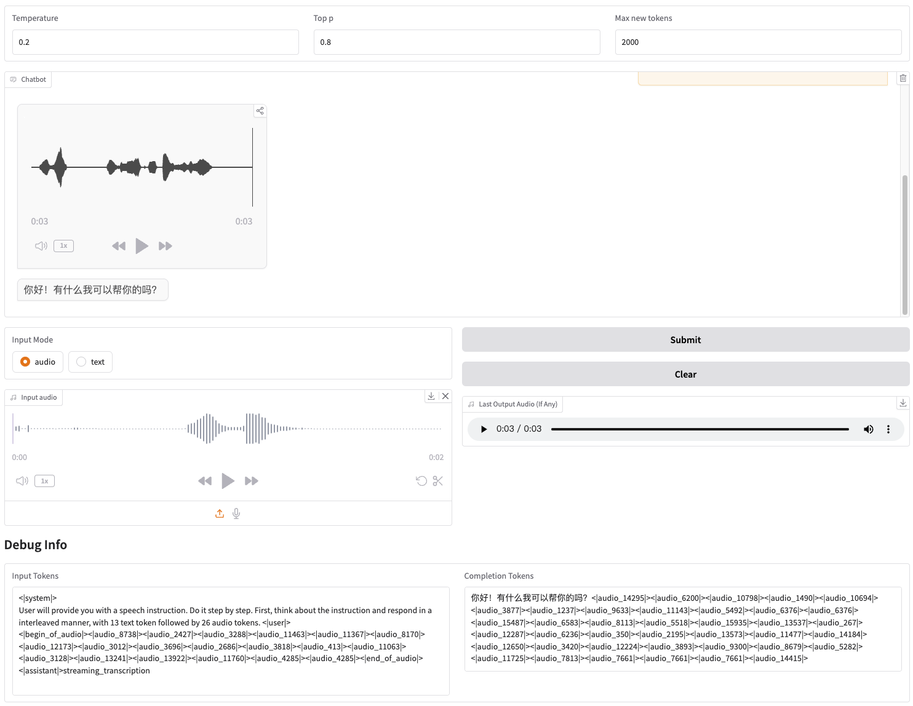

# GLM-4-Voice
<p align="center">
📄<a href="https://arxiv.org/abs/2412.02612" target="_blank"> Report </a> • 🤗 <a href="https://huggingface.co/THUDM/glm-4-voice-9b" target="_blank">HF Repo</a> • 🤖 <a href="https://modelscope.cn/studios/ZhipuAI/GLM-4-Voice-Demo" target="_blank">Demo</a> • 🐦 <a href="https://twitter.com/thukeg" target="_blank">Twitter</a>
</p>

Read this in [English](./README_en.md)

GLM-4-Voice 是智谱 AI 推出的端到端语音模型。GLM-4-Voice 能够直接理解和生成中英文语音，进行实时语音对话，并且能够遵循用户的指令要求改变语音的情感、语调、语速、方言等属性。

## Model Architecture


GLM-4-Voice 由三个部分组成：
* GLM-4-Voice-Tokenizer: 通过在 [Whisper](https://github.com/openai/whisper) 的 Encoder 部分增加 Vector Quantization 并在 ASR 数据上有监督训练，将连续的语音输入转化为离散的 token。每秒音频平均只需要用 12.5 个离散 token 表示。
* GLM-4-Voice-Decoder: 基于 [CosyVoice](https://github.com/FunAudioLLM/CosyVoice) 的 Flow Matching 模型结构训练的支持流式推理的语音解码器，将离散化的语音 token 转化为连续的语音输出。最少只需要 10 个语音 token 即可开始生成，降低端到端对话延迟。
* GLM-4-Voice-9B: 在 [GLM-4-9B](https://github.com/THUDM/GLM-4) 的基础上进行语音模态的预训练和对齐，从而能够理解和生成离散化的语音 token。

预训练方面，为了攻克模型在语音模态下的智商和合成表现力两个难关，我们将 Speech2Speech 任务解耦合为“根据用户音频做出文本回复”和“根据文本回复和用户语音合成回复语音”两个任务，并设计两种预训练目标，分别基于文本预训练数据和无监督音频数据合成语音-文本交错数据以适配这两种任务形式。GLM-4-Voice-9B 在 GLM-4-9B 的基座模型基础之上，经过了数百万小时音频和数千亿 token 的音频文本交错数据预训练，拥有很强的音频理解和建模能力。

对齐方面，为了支持高质量的语音对话，我们设计了一套流式思考架构：根据用户语音，GLM-4-Voice 可以流式交替输出文本和语音两个模态的内容，其中语音模态以文本作为参照保证回复内容的高质量，并根据用户的语音指令要求做出相应的声音变化，在最大程度保留语言模型智商的情况下仍然具有端到端建模的能力，同时具备低延迟性，最低只需要输出 20 个 token 便可以合成语音。

## Model List

|         Model         |       Type       |                                                                     Download                                                                     |
|:---------------------:|:----------------:|:------------------------------------------------------------------------------------------------------------------------------------------------:|
| GLM-4-Voice-Tokenizer | Speech Tokenizer | [🤗 Huggingface](https://huggingface.co/THUDM/glm-4-voice-tokenizer) [🤖 ModelScope](https://modelscope.cn/models/ZhipuAI/glm-4-voice-tokenizer) |
|    GLM-4-Voice-9B     |    Chat Model    |        [🤗 Huggingface](https://huggingface.co/THUDM/glm-4-voice-9b) [🤖 ModelScope](https://modelscope.cn/models/ZhipuAI/glm-4-voice-9b)        |
|  GLM-4-Voice-Decoder  |  Speech Decoder  |   [🤗 Huggingface](https://huggingface.co/THUDM/glm-4-voice-decoder) [🤖 ModelScope](https://modelscope.cn/models/ZhipuAI/glm-4-voice-decoder)   |

## Usage
我们提供了可以直接启动的 Web Demo。用户可以输入语音或文本，模型会同时给出语音和文字回复。



### Preparation

首先下载仓库
```shell
git clone --recurse-submodules https://github.com/THUDM/GLM-4-Voice
cd GLM-4-Voice
```
然后安装依赖。也可以使用我们提供的镜像 `zhipuai/glm-4-voice:0.1` 以跳过这一步。
```shell
pip install -r requirements.txt
```
由于 Decoder 模型不支持通过 `transformers` 初始化，因此 checkpoint 需要单独下载。

```shell
# git 模型下载，请确保已安装 git-lfs
git lfs install
git clone https://huggingface.co/THUDM/glm-4-voice-decoder
```

### Launch Web Demo

1. 启动模型服务

```shell
python model_server.py --host localhost --model-path THUDM/glm-4-voice-9b --port 10000 --dtype bfloat16 --device cuda:0
```

如果你需要使用 Int4 精度启动，请运行

```shell
python model_server.py --host localhost --model-path THUDM/glm-4-voice-9b --port 10000 --dtype int4 --device cuda:0
```

此命令会自动下载 `glm-4-voice-9b`。如果网络条件不好，也手动下载之后通过 `--model-path` 指定本地的路径。

2. 启动 web 服务

```shell
python web_demo.py --tokenizer-path  THUDM/glm-4-voice-tokenizer --model-path THUDM/glm-4-voice-9b --flow-path ./glm-4-voice-decoder
```

即可在 http://127.0.0.1:8888 访问 web demo。

此命令会自动下载 `glm-4-voice-tokenizer` 和 `glm-4-voice-9b`。 请注意，`glm-4-voice-decoder` 需要手动下载。

如果网络条件不好，可以手动下载这三个模型之后通过 `--tokenizer-path`, `--flow-path` 和 `--model-path` 指定本地的路径。

### Known Issues

* Gradio 的流式音频播放效果不稳定。在生成完成后点击对话框中的音频质量会更高。

## Cases

我们提供了 GLM-4-Voice 的部分对话案例，包括控制情绪、改变语速、生成方言等。

* 用轻柔的声音引导我放松

https://github.com/user-attachments/assets/4e3d9200-076d-4c28-a641-99df3af38eb0

* 用激动的声音解说足球比赛

https://github.com/user-attachments/assets/0163de2d-e876-4999-b1bc-bbfa364b799b

* 用哀怨的声音讲一个鬼故事

https://github.com/user-attachments/assets/a75b2087-d7bc-49fa-a0c5-e8c99935b39a

* 用东北话介绍一下冬天有多冷

https://github.com/user-attachments/assets/91ba54a1-8f5c-4cfe-8e87-16ed1ecf4037

* 用重庆话念“吃葡萄不吐葡萄皮”

https://github.com/user-attachments/assets/7eb72461-9e84-4d8e-9c58-1809cf6a8a9b

* 用北京话念一句绕口令

https://github.com/user-attachments/assets/a9bb223e-9c0a-440d-8537-0a7f16e31651

  * 加快语速

https://github.com/user-attachments/assets/c98a4604-366b-4304-917f-3c850a82fe9f

  * 再快一点

https://github.com/user-attachments/assets/d5ff0815-74f8-4738-b0f1-477cfc8dcc2d

## Acknowledgements

本项目的部分代码来自：
* [CosyVoice](https://github.com/FunAudioLLM/CosyVoice)
* [transformers](https://github.com/huggingface/transformers)
* [GLM-4](https://github.com/THUDM/GLM-4)

## 协议

+ GLM-4 模型的权重的使用则需要遵循 [模型协议](https://huggingface.co/THUDM/glm-4-voice-9b/blob/main/LICENSE)。

+ 本开源仓库的代码则遵循 [Apache 2.0](LICENSE) 协议。

## 引用

```
@misc{zeng2024glm4,
      title={GLM-4-Voice: Towards Intelligent and Human-Like End-to-End Spoken Chatbot}, 
      author={Aohan Zeng and Zhengxiao Du and Mingdao Liu and Kedong Wang and Shengmin Jiang and Lei Zhao and Yuxiao Dong and Jie Tang},
      year={2024},
      eprint={2412.02612},
      archivePrefix={arXiv},
      primaryClass={cs.CL},
      url={https://arxiv.org/abs/2412.02612}, 
}
```

```
@misc{zeng2024scaling,
      title={Scaling Speech-Text Pre-training with Synthetic Interleaved Data}, 
      author={Aohan Zeng and Zhengxiao Du and Mingdao Liu and Lei Zhang and Shengmin Jiang and Yuxiao Dong and Jie Tang},
      year={2024},
      eprint={2411.17607},
      archivePrefix={arXiv},
      primaryClass={cs.CL},
      url={https://arxiv.org/abs/2411.17607}, 
}
```
